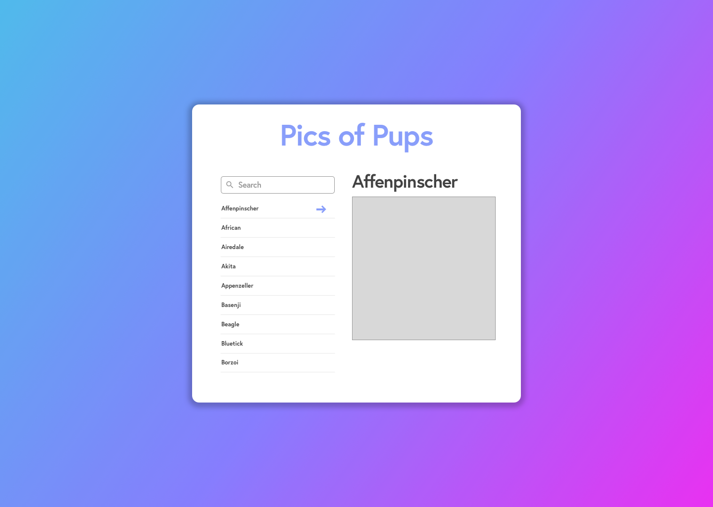

# Interview Challenge

1. Create a simple front end js app with either Vue or React.
1. Create SQL queries that satisfy the written criteria.

## Getting Started

Start by forking this repo.

### Fronend /JS

With either Vue or React, using the simple design below and the free dog api found [here](https://dog.ceo/dog-api/documentation/) create an interactive experience that meets the following criteria

1. Show a list of dog breeds
2. Filter the list of dog breeds with a simple text search
3. Show an image of each dog breed when clicking a breed from the list


[https://dog.ceo/dog-api/documentation/](https://dog.ceo/dog-api/documentation/)

___
#### Building With React

In the react-interview folder is a bare bones CRA app. To use this starter project run the following commands.

```
cd react-interview
```

```
npm install
```

```
npm start
```

This should start up the react project at `localhost:3000`

___
#### Building With Vue

In the vue-interview folder is a bare bones Vue-cli app. To use this starter project run the following commands.

```
cd vue-interview
```

```
npm install
```

```
npm run serve
```

This should start up the vue project at `localhost:8080`

### Backend / SQL

Follow the instructions found in the [Query Exercise File](query_exercise.md)